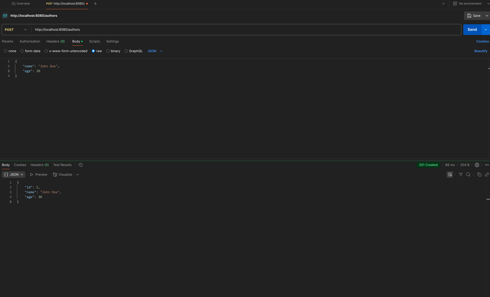
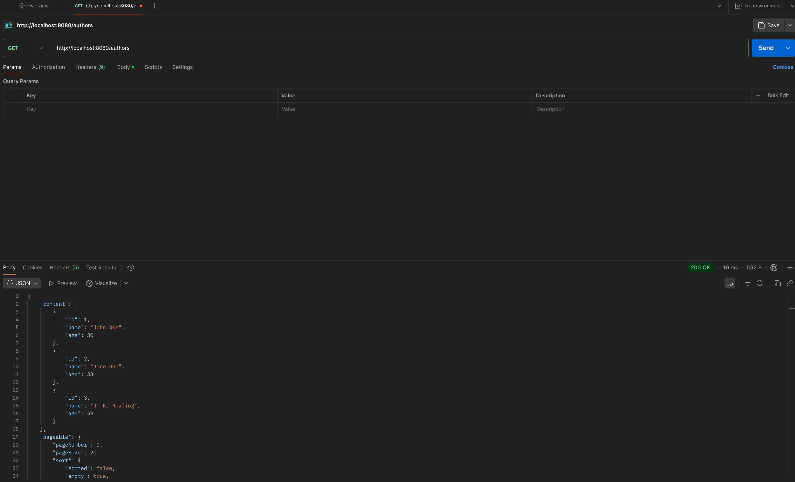
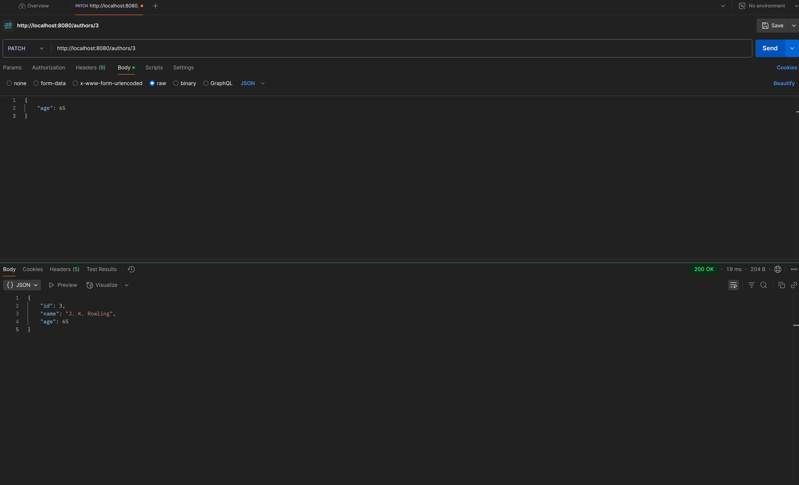
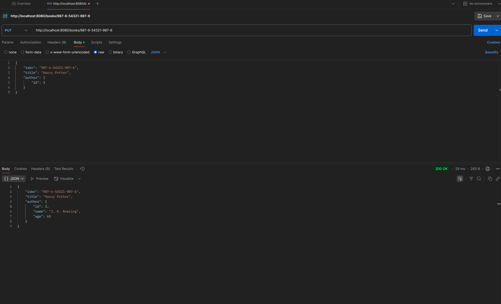
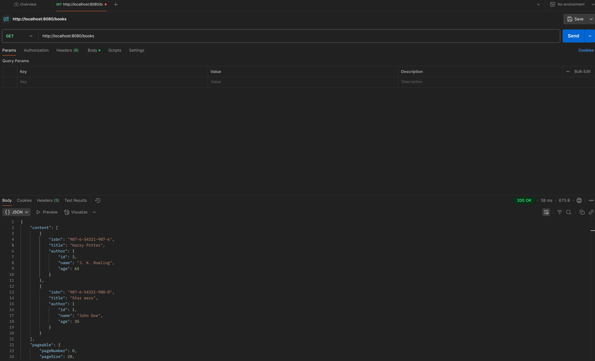
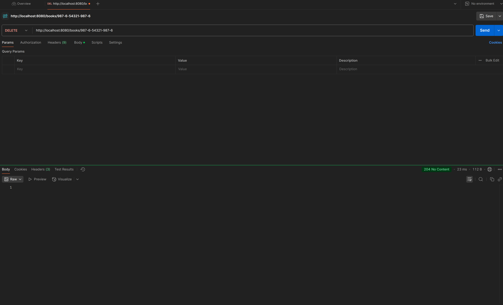
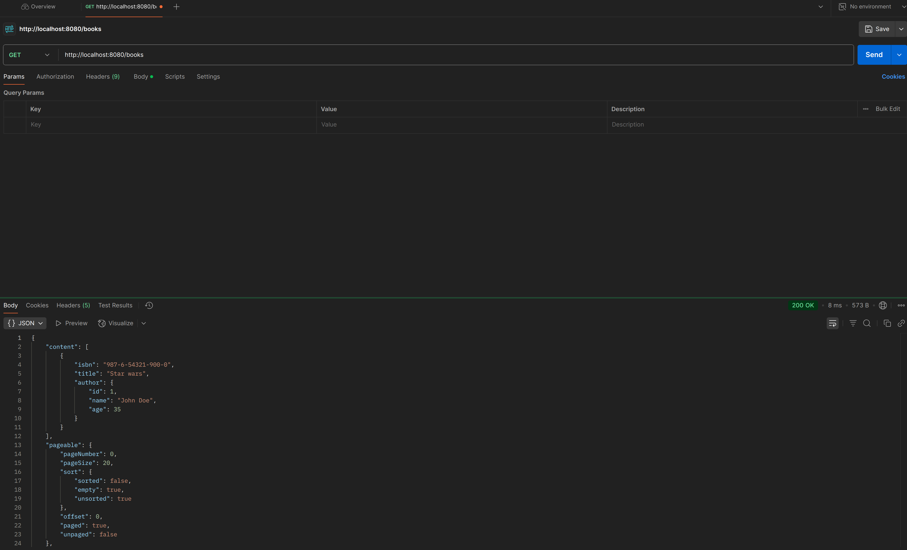

# 📚 Author & Book Management System

A CRUD (Create, Read, Update, Delete) application built with Spring Boot and Spring Data JPA. This project allows users to manage authors and their associated books, demonstrating RESTful API design, pagination, entity relationships, and data persistence.

## 🚀 Features

- Manage Authors:
    - Create, view, update, and delete authors.
- Manage Books:
    - Create, view, update, and delete books.
    - Associate books with authors.
- Pagination support for listing authors and books.
- Data validation and error handling.

## 🛠️ Technologies Used

- Java 21
- Spring Boot 3.4.3
- Spring Data JPA
- Spring Web (Spring MVC)
- H2 Database (for development and testing)
- PostGreSQL (for production)
- Maven
- ModelMapper
- JUnit & MockMvc (for testing)

## 📦 Getting Started

### Prerequisites

- Java 21
- Maven

### Installation

1. Clone the repository:

   ```bash
   git clone https://github.com/LiuChangMing88/Author-Book-Management-System-Spring-Boot-CRUD-Application.git
   cd Author-Book-Management-System-Spring-Boot-CRUD-Application
   ```
   
2. Start the database using docker:

    ```bash
   docker-compose up
    ```

3. Build the project:
    ```bash
    mvnw clean install
    ```
   
4. Run the tests:
    ```bash
    mvnw test
    ```
   
5. Run the application:
    ```bash
    mvnw spring-boot:run
    ```
   
6. Access the application:

API endpoints: http://localhost:8080/api

## 📬 API Endpoints
- Authors
  - `GET /api/authors` - Retrieve all authors (pagination implemented)
  - `GET /api/authors/{id}` - Retrieve an author
  - `POST /api/authors` - Create a new author
  - `PUT /api/authors` - Update an existing author fully
  - `PATCH /api/authors` - Update an existing author partially
  - `DELETE /api/authors` - Delete an author
- Books
  - `GET /api/books` - Retrieve all books (pagination implemented)
  - `GET /api/books/{isbn}` - Retrieve a book
  - `PUT /api/books/{isbn}` - Both creating a new book and updating a book fully
  - `PATCH /api/books` - Update a book partially
  - `DELETE /api/books` - Delete a book

## Screenshots

These screenshots are from postman API endpoints testing.

### Authors
- Creating authors:


- Getting authors after creation (I have created 3 authors for demonstration):


- Patching an author:


### Books
- Creating a book (the author is patched in the previous picture):


- Getting books (I have created 2 books here):


- Deleting a book:


- Getting books after a book deletion:


## 📚 Acknowledgments

- This project is based on the tutorial "The ULTIMATE Guide to Spring Boot: Spring Boot for Beginners" by Devtiro. You can find the original tutorial [here](https://www.youtube.com/watch?v=Nv2DERaMx-4).

- This project helped me learn a lot of things:
  - The core concepts of spring boot: application context, beans, dependency injections, auto-configurations, application.properties...
  - The core functionality of maven, maven lifecycles...
  - Spring modules and how to use them: spring web, lombok, spring data jpa, modelmapper,...
  - Integration of databases into application: PostGreSQL for production and H2 in-memory for development.
  - Design patterns: repositories, DAO, DTO...
  - Production coding conventions: separation of concerns, loosely-coupling, spring application layers...
  - Rest API endpoints and json, jackson, object mapper.
  - ...